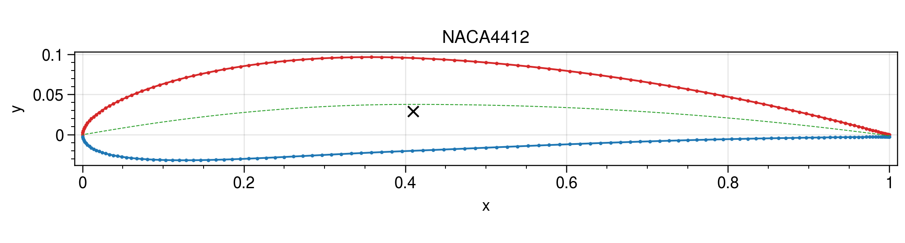
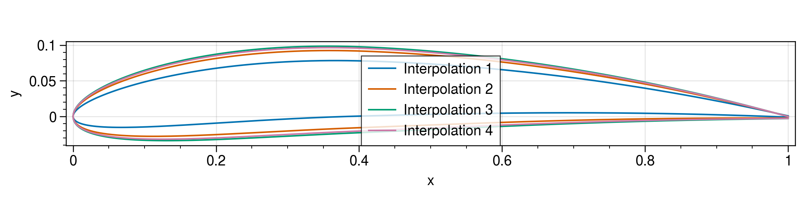

# AirfoilFast

Pure Julia package to handle airfoils.

```julia
using AirfoilFast

# Load from file (.dat or .csv)
af1 = Airfoil("data/NACA4408.dat")
af2 = Airfoil("data/NACA4412.dat")

# Properties
chordlength(af1)
camberlength(af1)
centroid(af1)

# Modification
normalize!(af2)

# Interpolate Airfoils
afs_int = interpolate_airfoils([af1, af2, af2], [0., 0.5, 1.0], Vector(LinRange(0, 1, 4)))

# Plotting
plot(af2)
plot(afs_int)
```

</img>
</img>


## License

This code is licensed under Apache 2.0.